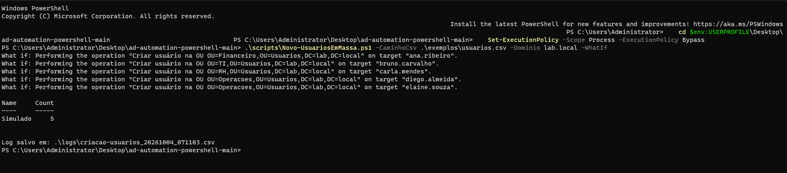
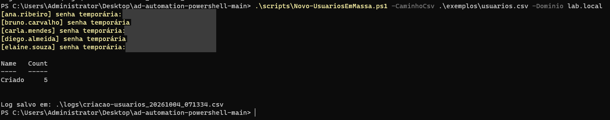
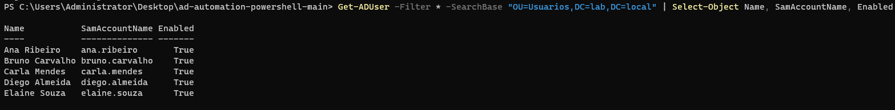
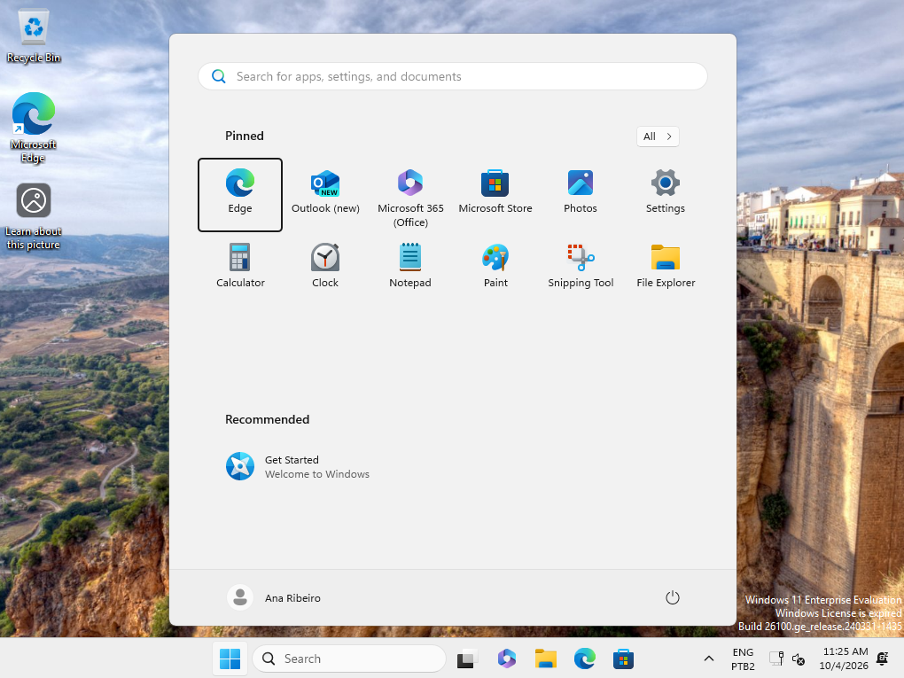
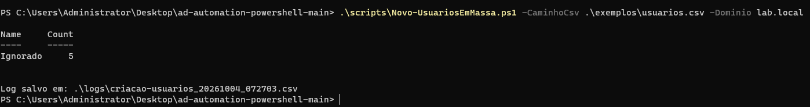

# Automação de Active Directory com PowerShell

Scripts para tarefas repetitivas de administração do Active Directory: criação de usuários em massa e relatório de contas inativas. Todos suportam `-WhatIf`, para simular antes de alterar o ambiente.

## Por que este projeto

No suporte N2, criar contas uma a uma e revisar contas esquecidas toma tempo e gera erro. Estes scripts padronizam o processo, registram o que foi feito e deixam a execução segura para testar.

## Scripts

| Script | O que faz |
| --- | --- |
| `scripts/Novo-UsuariosEmMassa.ps1` | Lê um CSV, valida os campos, cria as contas na OU certa, adiciona aos grupos e gera log |
| `scripts/Relatorio-ContasInativas.ps1` | Lista contas sem login há N dias, exporta CSV e, opcionalmente, desabilita e move para quarentena |

## Pré-requisitos

- Windows com módulo **ActiveDirectory** (RSAT) ou execução em um controlador de domínio
- Permissão para criar e alterar usuários
- PowerShell 5.1 ou superior

## Como usar

### 1. Criar usuários em massa

Edite `exemplos/usuarios.csv` com os dados reais (as OUs e grupos precisam existir).

```powershell
# Simula, sem criar nada
.\scripts\Novo-UsuariosEmMassa.ps1 -CaminhoCsv .\exemplos\usuarios.csv -Dominio lab.local -WhatIf

# Executa de verdade
.\scripts\Novo-UsuariosEmMassa.ps1 -CaminhoCsv .\exemplos\usuarios.csv -Dominio lab.local
```

Cada conta recebe uma senha temporária aleatória, com troca obrigatória no primeiro login. A senha aparece só na tela, nunca no log.

### 2. Relatório de contas inativas

```powershell
# Só o relatório (contas sem login há 90 dias)
.\scripts\Relatorio-ContasInativas.ps1 -Dias 90

# Simula desabilitar e mover para quarentena
.\scripts\Relatorio-ContasInativas.ps1 -Dias 120 -Desabilitar -OUQuarentena "OU=Inativos,DC=lab,DC=local" -WhatIf
```

## Boas práticas aplicadas

- `-WhatIf` em tudo que altera o AD
- Validação de campos obrigatórios e de usuários já existentes
- Log em CSV com o resultado de cada linha
- Nenhuma senha gravada em arquivo
- Ajuda embutida: `Get-Help .\scripts\Novo-UsuariosEmMassa.ps1 -Full`

## Evidências (testado no laboratório)

**1. Simulação com `-WhatIf`: nada é criado, só mostra o que seria feito**



**2. Execução real: 5 usuários criados, cada um com senha temporária aleatória**



**3. Usuários no AD, na OU correta e habilitados**



**4. Primeiro login em uma estação do domínio: troca de senha obrigatória**


**5. Login concluído com o usuário criado pelo script**



**6. Rodar de novo não duplica nem sobrescreve: os 5 são ignorados**



## Ambiente de teste

Os scripts foram pensados para o meu laboratório com AD no Hyper-V: [lab-microsoft-hyperv](https://github.com/warlley-santos-git/lab-microsoft-hyperv).

Os dados do CSV de exemplo são fictícios.

---

Autor: **Warlley Santos** · [LinkedIn](https://linkedin.com/in/warlley-santos)
